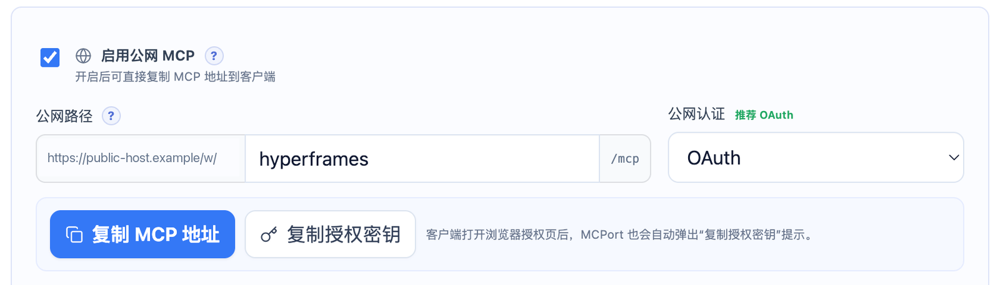
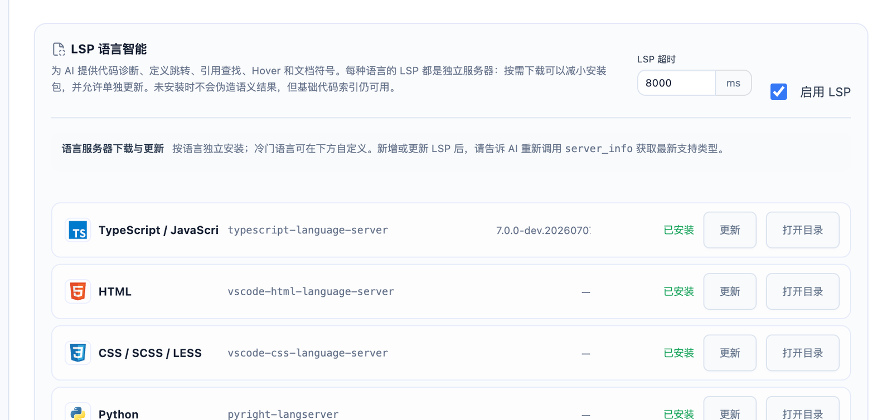

<p align="center">
  <picture>
    <source media="(prefers-color-scheme: dark)" srcset="resources/MCPort-Logo-Dark.png">
    <source media="(prefers-color-scheme: light)" srcset="resources/MCPort-Logo-Light.png">
    
  </picture>
</p>

<p align="center">把本机项目安全地连接到支持 MCP 的 AI 客户端。</p>

# MCPort

MCPort 是一个本地优先的 MCP 工具。它让 AI 客户端能够在你明确选择的项目目录中读取代码、搜索文件、理解符号、查看 Git、修改文件，并在授权后执行受控命令。

项目文件、运行状态和凭据默认留在本机。你可以只使用本地 MCP，也可以为指定 Workspace 开启 OAuth 或 Bearer Token 公网访问。

English version: [README.md](README.md)

## 软件截图

### Workspace 状态与 AI 能力


### 公网 MCP 与 OAuth 设置



### LSP 语言服务器管理



## 主要功能

- 让 AI 阅读和搜索项目文件、代码、图片及目录
- 提供代码索引、定义跳转、引用查找、Hover 和文档符号
- 查看 Git 状态、差异、提交记录和 blame
- 在 Workspace 内创建、修改、导入、复制、移动和删除文件
- 通过任务、Checkpoint 和验证流程跟踪修改结果
- 在权限允许时执行受控开发命令
- 将一个或多个 Workspace 连接到本地或公网 MCP 客户端
- 按需安装和更新常见语言的 LSP，冷门语言可手动扩展
- 可选的 Computer Use，通过逐次确认安全地查看屏幕和操作鼠标键盘

## 连接 AI 客户端

在 MCPort 的“项目”中添加项目目录，开启 Workspace 的 MCP 开关，然后复制连接信息。将 MCPort 提供的地址添加到 AI 客户端的 MCP 设置中。公网连接请使用 Workspace 的公网地址，并按设置使用 OAuth 或 Bearer Token。

Claude Desktop、Cursor、Windsurf、Cline、Continue 等常见客户端都支持 MCP。不同客户端的设置位置和格式可能不同，请按照客户端当前的 MCP 文档操作，并粘贴 MCPort 提供的地址或配置。

安装或更新 LSP 后，请让 AI 重新调用 `server_info`，获取最新支持类型和状态。

## macOS 安装

当前 macOS 版本未签名。将 `MCPort.app` 拖入 `/Applications` 后，在终端执行：

```bash
xattr -dr com.apple.quarantine "/Applications/MCPort.app"
```

请确认下载来源为官方 Release，并先核对 `SHA256SUMS.txt`。

## 连接方式

本地访问默认只接受 loopback 请求。公网访问支持 Cloudflare Tunnel、TryCloudflare、FRP Client 或外部自建通道，并使用 OAuth（推荐）或 Bearer Token 认证。

公网地址使用 `/w/<workspace>/mcp` 路由，例如：

```text
https://mcp.example.com/w/my-project/mcp
```

## 文件、代码和 LSP

MCPort 只允许在选定 Workspace 内操作文件，并会在真实路径和符号链接解析后再次检查边界。基础代码索引支持 TypeScript/JavaScript、Python、Go、Rust、Java、C/C++ 和 PHP。

语言服务器按语言独立管理，可以按需下载和更新。支持 TypeScript/JavaScript、HTML、CSS/SCSS/LESS、Python、JSON、YAML、Markdown、Go、Rust、Java、C、C++ 和 PHP，也可以添加自定义 LSP。

## 权限档位

- `readonly`：查看项目、搜索、代码理解、Git 只读和历史查询
- `standard`：增加文件修改、导入、Checkpoint、任务和快速验证
- `full`：增加受控命令、命令会话、操作恢复和完整验证

命令以 executable + args 数组执行，不使用任意 shell 字符串，并继续受全局开关、精确命令白名单、超时、输出大小和高风险确认控制。

Computer Use 默认关闭，开启后默认只在本地 MCP 的 `full` 档可用；也可以通过独立开关允许已认证、使用 `full` 档的公网 Workspace 调用。截图及鼠标键盘操作每次仍需要在 MCPort Desktop 明确确认。

## 安全边界

Workspace 文件操作经过 realpath 和符号链接边界检查。文件修改支持 SHA256 前置校验、事务回滚和 Checkpoint。公网 Workspace 始终要求认证。Token、Tunnel 凭据和其他敏感信息使用系统安全存储，并在日志和 Tool Trace 中脱敏。

Runtime 以当前登录用户运行；命令白名单不是操作系统级沙箱。

## 文档

- [Desktop 使用指南](docs/desktop-app.md)
- [AI 客户端使用指南](docs/ai-usage.md)
- [MCP 工具目录](docs/tools.md)
- [LSP 语言服务器说明](docs/lsp.md)
- [安全说明](docs/security.md)
- [公网接入与 OAuth](docs/architecture/public-gateway-and-oauth.md)
- [工具与权限](docs/architecture/tools-and-execution.md)
- [发布指南](docs/releasing.md)

## 开源协作

MCPort 由 Sky 维护，采用 MIT License。欢迎提交 Issue 和 Pull Request。详见 [贡献指南](CONTRIBUTING.md)、[安全政策](SECURITY.md)、[行为准则](CODE_OF_CONDUCT.md)、[隐私说明](docs/privacy.md) 和 [第三方许可说明](THIRD_PARTY_NOTICES.md)。

第三方 LSP 按用户选择从各自生态的官方包管理器或发布渠道安装，不随 MCPort 安装包分发；使用时请遵守对应项目的许可证和条款。
